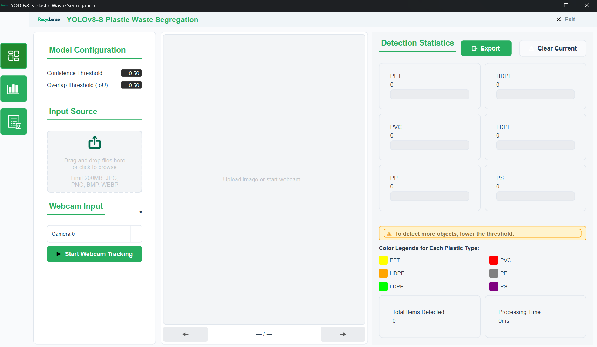
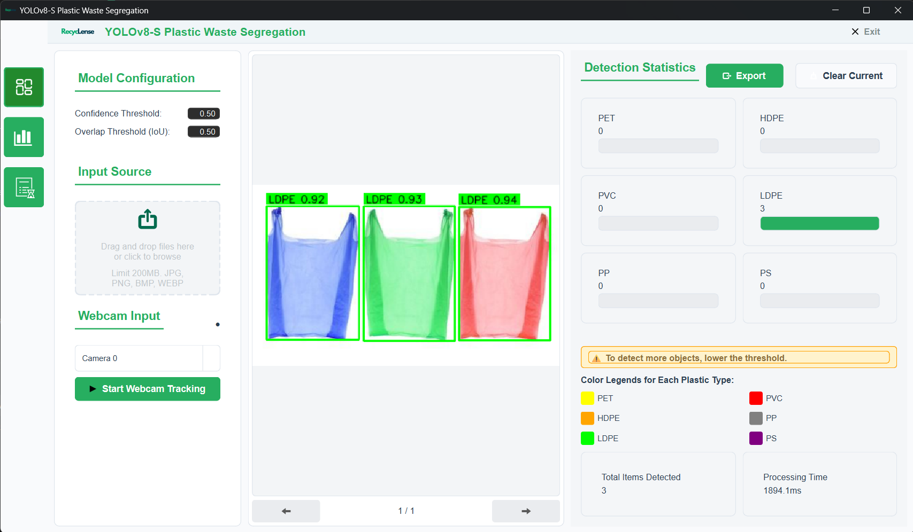
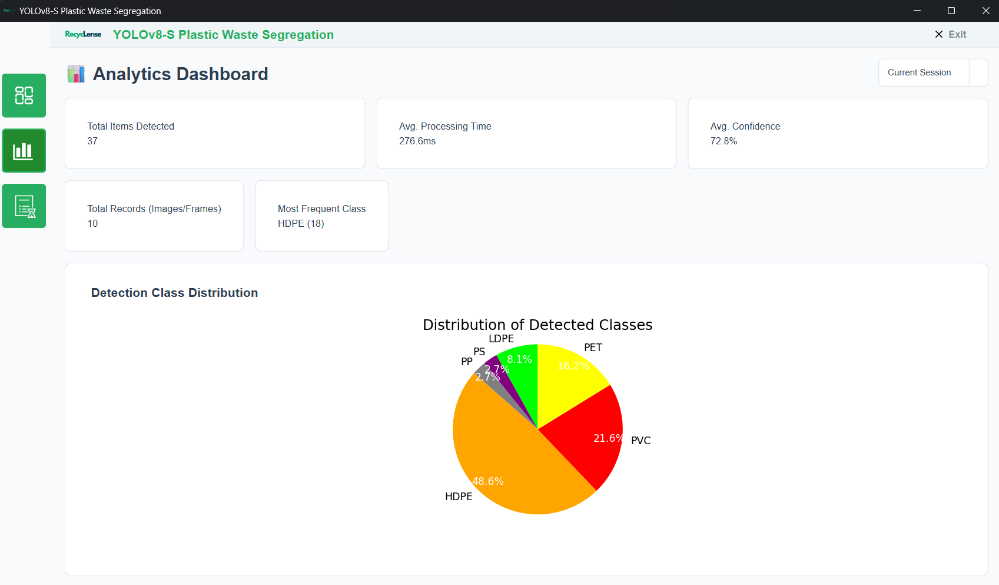
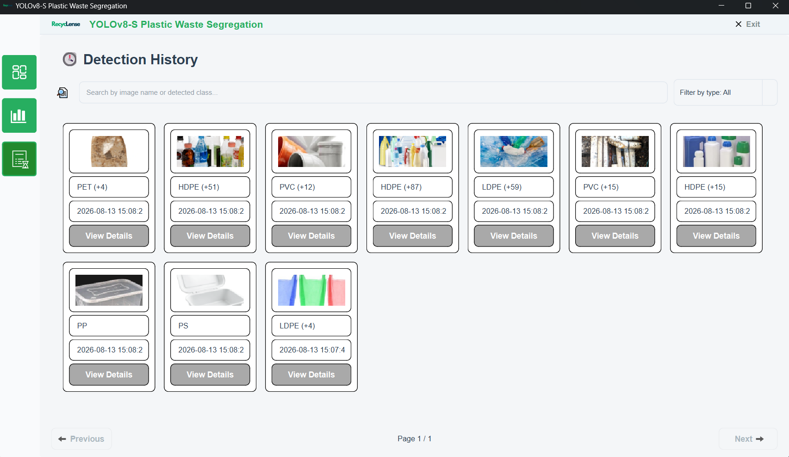

# YOLOv8-S in Plastic Waste Segregation

A desktop GUI application that uses a fine-tuned **YOLOv8-s** model to detect and classify plastic waste by resin type (e.g. PET, HDPE, PVC, LDPE, PP, PS) in real time, developed as part of an undergraduate thesis.







## Overview

- **Task:** Real-time object detection and classification of plastic waste types
- **Model:** YOLOv8-s (Ultralytics), fine-tuned on a custom-labeled dataset
- **Interface:** PyQt — desktop GUI
- **Input:** Webcam feed / uploaded images
- **Output:** Bounding boxes with predicted plastic type and confidence score

## Motivation

Plastic pollution poses a significant threat in Sustainable Development Goal (SDG) 11, which aimed to make cities and human settlements inclusive, safe, resilient, and sustainable. Despite mitigation of the said problem, traditional manual sorting methods remain inefficient and prone to errors. To address this issue, the researchers utilized You Only Look Once version 8-Small (YOLOv8-S), a deep learning model optimized for real-time object detection, to classify six major plastic types: Polyethylene Terephthalate (PET), High-Density Polyethylene (HDPE), Low-Density Polyethylene (LDPE), Polyvinyl Chloride (PVC), Polypropylene (PP), and Polystyrene (PS) under various conditions such as deformed, dirty, and overlapping.

## Features

- Real-time detection via webcam or static image input
- Classification into plastic resin categories
- Simple GUI for non-technical users
- Displays confidence scores and bounding boxes per detection

## Model Performance

| Metric | Value |
|---|---|
| mAP@0.5 | 0.702 |
| mAP@0.5:95 | 0.792 |
| Precision (Macro Avg) | 0.797 |
| Recall (Macro Avg) | 0.431 |
| F1-Score (Macro Avg) | 0.529 |
| Classes | PET, HDPE, PVC, LDPE, PP, PS |
| Dataset size | 8,238 images |

Trained on a custom dataset labeled in Roboflow. 

## Installation

```bash
git clone https://github.com/tinaybaliguat/YOLOv8-S-in-Plastic-Waste-Segregation.git
cd YOLOv8-S-in-Plastic-Waste-Segregation
python -m venv venv
source venv/bin/activate      # Windows: venv\Scripts\activate
pip install -r requirements.txt
```

### Download model weights

Model weights are tracked with Git LFS. Make sure Git LFS is installed before cloning:

```bash
git lfs install
```

If you already cloned without LFS set up:

```bash
git lfs pull
```

## Usage

```bash
python app/rec.py
```

1. Launch the app.
2. Can upload image and can select webcam to use, press start afterwards
3. Detections appear with bounding boxes and predicted plastic type.

## Project Structure

```
.
├── app/
│   └── rec.py           # Main GUI application
├── assets/
│   └── icons/           # GUI icons/images
├── models/
│   └── best.pt           # Trained YOLOv8-s weights 
├── docs/
│   └── recyclense-1.png
│   └── recyclense-2.png
│   └── recyclense-3.png
│   └── recyclense-4.png
├── requirements.txt
├── .gitattributes         # Git LFS tracking rules
├── .gitignore
├── LICENSE
└── README.md
```

## Tech Stack

- [Ultralytics YOLOv8](https://github.com/ultralytics/ultralytics)
- Python
- OpenCV
- PyQt5 

## Thesis Info

- **Title:** YOLOv8-S in Plastic Waste Segregation
- **Author(s):** Cristina Baliguat, Mariel Louise  Gomez, Jorlyn Roa
- **Institution:** University of Negros Occidental - Recoletos
- **Year:** 2026
- **Advisor:** Dr. Elmer Haro

Full thesis paper: available upon request

## License

This project is licensed under the [MIT License](LICENSE).

## Acknowledgments

- Ultralytics YOLOv8
- WaDaBa Waste Database
- Roboflow
- Dr. Elmer Haro and the rest of CIT Faculty
- My family, friends, and team members
